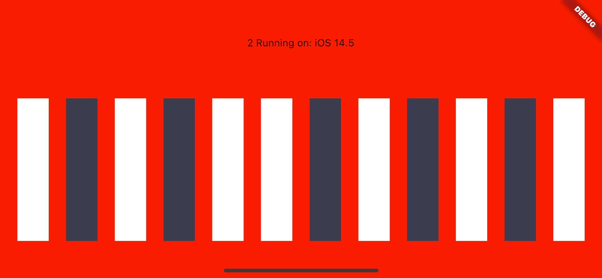

# use KMM to write a flutter plugin

The reference [plugin_codelab](https://github.com/flutter/codelabs/tree/master/plugin_codelab) example plugin that accompanies 
the [How to write a Flutter plugin](https://codelabs.developers.google.com/codelabs/write-flutter-plugin) codelab.

I changed [plugin_codelab](https://github.com/flutter/codelabs/tree/master/plugin_codelab) to a flutter plugin that 
write with kmm.

How to run:

Android: run shared/plugin_codelab/example/android

iOS: 

1、build shared.framework 

```
use ./gradlew releaseIOSFramework
or use new version Android Studio sync
```

2、run shared/plugin_codelab/example/ios

Tips: before run，shared/build/cocoapods/framework/shared.framework should be generated. The shared.h header file shared/build/cocoapods/framework/shared.framework/Headers/shared.h is generated.




了解更多请查看博文[Kotlin/Native 用KMM写Flutter插件](https://libill.github.io/2021/10/28/kmm-flutter-plugin/)